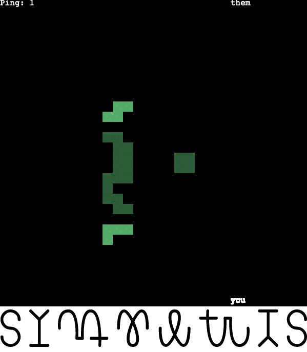

# Hathora Topdown Shooter

## Overiew 

Multiplayer 2D shooter demo made using [Hathora Buildkits](https://github.com/hathora/buildkits) + [Phaser](http://phaser.io/)

Assets from [Kenney](https://kenney.nl/assets/topdown-shooter)

## Try it

The game is playable at https://visionary-sunshine-827244.netlify.app/



## Running locally 

To run locally:

- Have node installed
- Get a Hathora `appId` and `appSecret` via https://console.hathora.dev/
- Create a .env file at the root with
```
APP_ID=<appId>
HATHORA_APP_SECRET=<appSecret>
```
- Start server: inside `server` directory run `npm start` (remember to `npm install` first)
- Start client: inside `client` directory run `npm start` (remember to `npm install` first)

## Architecture

Fully server authoritative game:
- Client sends user inputs to server
- Server processes the inputs and runs game simulation (at 20fps)
- Server broadcasts state snapshots to clients (at 20fps)
- Client interpolates the state snapshots and renders the game UI (at 60fps)
- No prediction on the client side

Room based architecture:
- One player creates a game session and gets back a `roomId`
- They send the `roomId` to others
- Others can join the same session with this `roomId`
